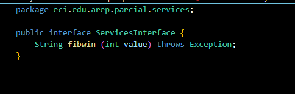
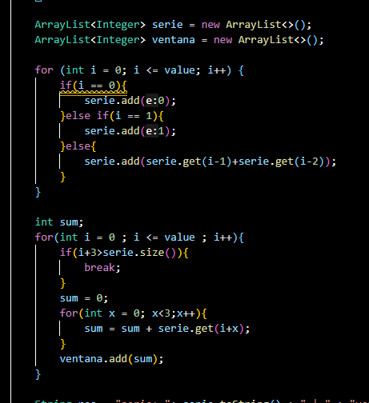
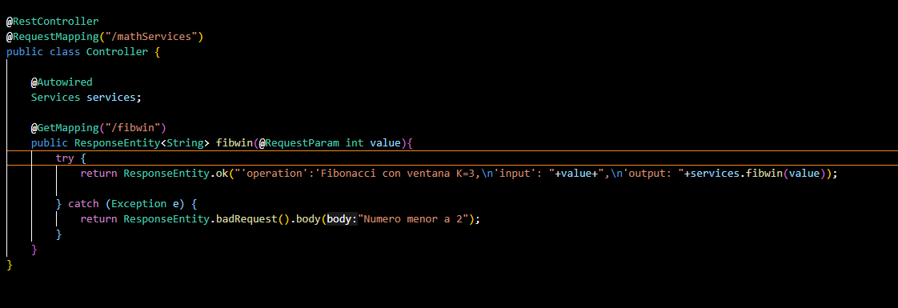
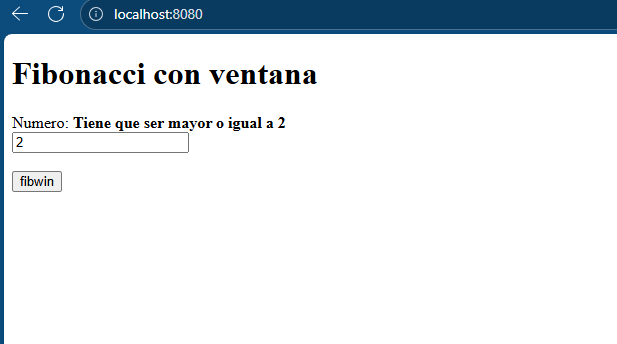
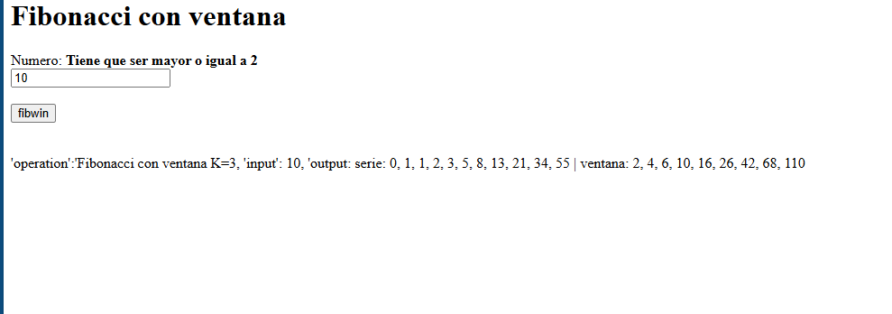
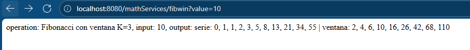

# AREP-Parcial-Corte2
**Hecho por:** [Alejandro Prieto](https://github.com/AlejandroPrieto82)
**10/22/2025**

---
  
**Codigo de mi service interface**

  
**Codigo de mi clase service, haciendo fibonacci de manera iterativa y recorriendo las ventanas de manera iterativa**  

  
**Codigo de mi clase controlador, clase que me permite recibir las peticiones solicitadas**    

  
**Codigo de mi index.html, la subi en static de las carpetas, para ir probando mas facil el servidor**

  
**Resultado que mi servidor funciona**  
***NOTA***: Este resultado esta, pero sin conectarme a las EC2, ni al proxy, por lo que, si lo conectara al proxi, podria obtener una respuesta correcta  

  
**Resultado de que el endpoint si funciona y devuelve lo que debe devolver**

